Télémètre musical PTS3 - PTS4

# 
Documentation finale du Projet

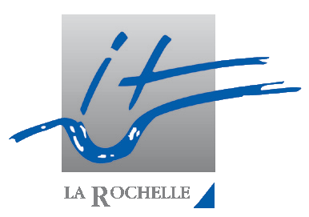 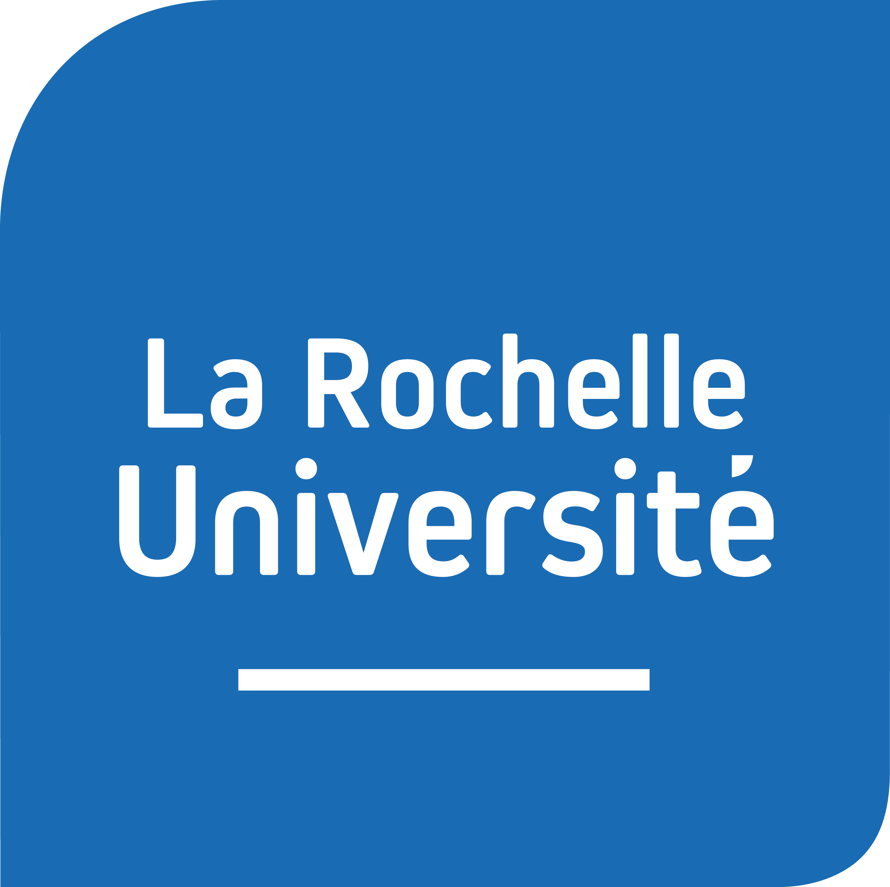

  

**Maîtrise d'ouvrage :**
- Brieuc BESTEL

**Tuteur du projet :**
- Jean-Michel BOHE

**Maîtrise d'oeuvre :**
- Lucas LALIDA
- Lucas STANISLAS
- Nicolas GODARD
- Botao WANG

## Sommaire
1. [Introduction](#introduction)
2. [Périmètre](#perimetre)
3. [Organisation](#orga)
    1. [Méthodologie](#methodologie)
    2. [Outils et Communication](#outils)
    3. [Organisation prévisionnelle](#orga_previ)
    4. [Répartition du travail](#repartition)
    5. [Organisation réelle](#orga_reelle)
4. [Produit](#produit)
    1. [Bilan du produit du PTS3](#bilan_pts3)
    2. [Objectifs du PTS4](#objectifs_pts4)
    3. [Bilan de réalisation du PTS4](#bilan_pts4)
    4. [Aspects techniques](#technique)
5. [Rétrospective finale](#retrospective)
    1. [Rétrospectives individuelles](#retro_indi)
    2. [Rétrospective d'équipe](#retro_equipe)
6. [Bilan du projet](#bilan_projet)
7. [Annexes](#annexes)

  

## Lexique 

- IDE : Integrated Development Environment -> Interface utilisée pour écrire et tester le code.
- LIDAR : Capteur de distance 
- IHM : Interface Humain-Machine
- Sprite : élément graphique (exemple : sprite d'une note bémol)

## 1. Introduction 

Dans le cadre d'un projet tutoré que nous devons réaliser lors de notre troisième et quatrième semestre de DUT Informatique, monsieur Brieuc Bestel a fait appel à nos services pour la création d’un « télémètre musical » sur Raspberry. Ce télémètre est destiné à être exposé en tant qu’installation artistique auprès d'un public novice. Cette démonstration a pour but d'initier des personnes à la musique en générale via une activité ludique et interactive.

Notre travail est découpé en deux périodes. La première période va de la semaine 40 (du 04/10 au 08/10/2021) à la semaine 3 (du 17/01 au 21/01/2022) correspondant à la fin de notre 3ème semestre. La deuxième période suit la première période de la semaine 4 (du 24/01 au 28/01/2022) à la semaine 14 (du 04/04 au 08/04/2022).

Ce rapport est un résumé golbale de notre projet (organisation, produit, rétrospectives).

 

## 2. Périmètre 

Le produit final est une carte Raspberry qui jouera une note de musique variant en fonction de la distance d'un utilisateur ou d’un objet détecté par un [LIDAR](#lexique) infrarouge. Cette carte Raspberry sera accompagnée d'une interface qui affichera la note jouée. Elle possédera également plusieurs options permettant de jouer ou d’arrêter une musique de fond, de changer de gamme (choix entre gamme mineure, blues ou japonaise) et de moduler un effet de reverb. L'interface finale devra être claire et instinctive afin d'en faciliter son utilisation.

## 3. Organisation 

Afin de réaliser notre projet, nous avons mis en place toute une organisation qui nous a permis de gagner en efficacité.

### 3.1 Méthodologie 

Lors de notre projet, nous avons décidé d'utiliser une méthodologie agile scrum. Chaque Dimanche soir, nous organisions une réunion sur Discord pour faire un bilan de la semaine passée et planifier nos objectifs de la semaine à venir (individuels et de groupes). 

 

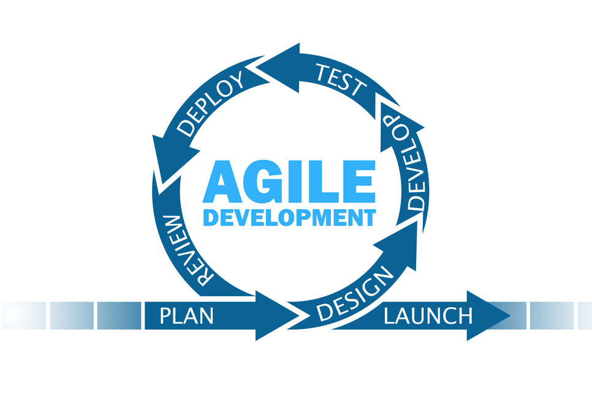
  

 

### 3.2 Outils et Communication 

Tout au long de notre projets, certains outils nous ont été très pratiques.

 

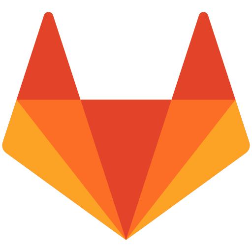

Commençons par Gitlab :

Nous avons utilisé GitLab (via la forge de l'IUT) afin de déposer et d'archiver nos codes faits sur la Raspberry. L'outil nous a été très pratique pour le partage des documents ou même pour certaines bibliothèques (voir la documentation technique).

 

Comme nous pouvons le voir ci-dessous, Gitlab garde une trâce de tout ce que nous avons fait sur notre projet (à noter qu'on a du mal à savoir qui a fait quoi car le compte de Lucas Lalida est connecté à la Raspberry, donc chaque push fait dessus est relié à son nom).

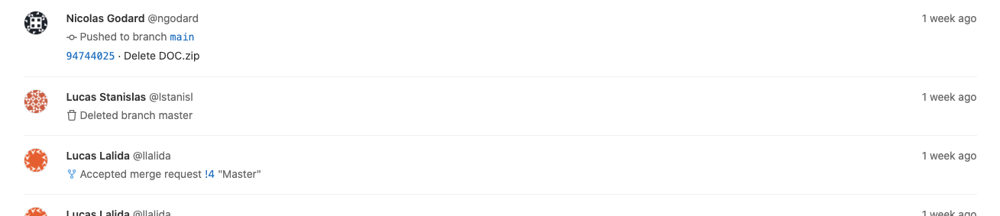  

  

Discord :

Notre outil principal de communication était discord. Via discord, nous pouvions communiquer entre nous, notre client et notre tuteur, partager des ressources ou encore travailler à distance en vocal.

  

Comme nous pouvons le voir ci-dessous, notre discord est constitué de canaux vocals et de salons textuels :
- Un canal "avancées"
- Un canal "général"
- Un canal "travail"
- Un salon "Réunion" que tout le monde pouvait rejoindre
- Deux salons "Travail Groupe" que nous seuls pouvions rejoindre

 

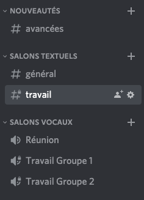

  

Le canal "général" nous permettait de poser des questions techniques à Monsieur Bestel et à organiser des rendez-vous pour y faire des démonstrations.

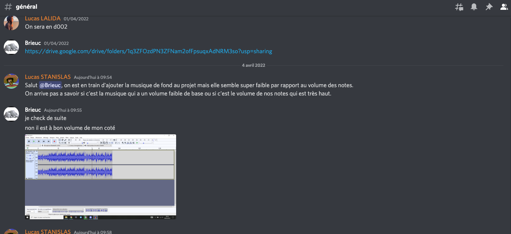

  

Le canal "avancées" nous a permis d'envoyer les nouveautés que nous avions à proposer.

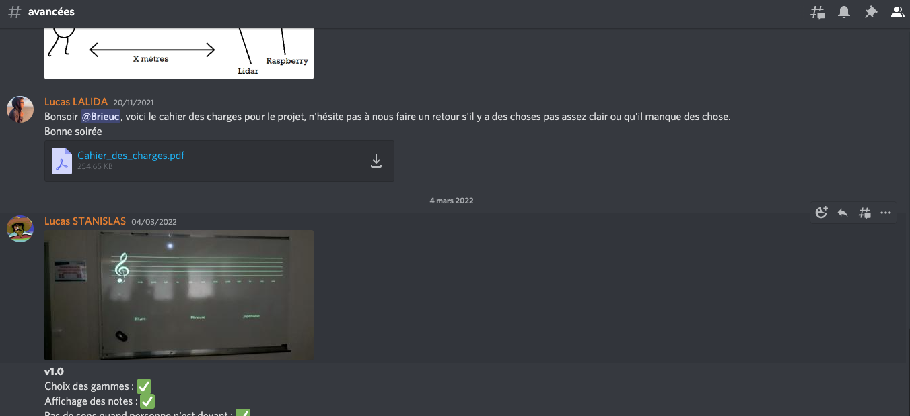

  

Enfin, nous utilisions le canal "travail" pour discuter entre nous, partager du codes et des images.

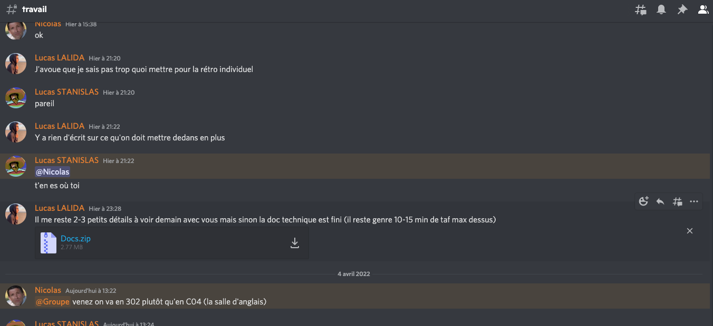

  

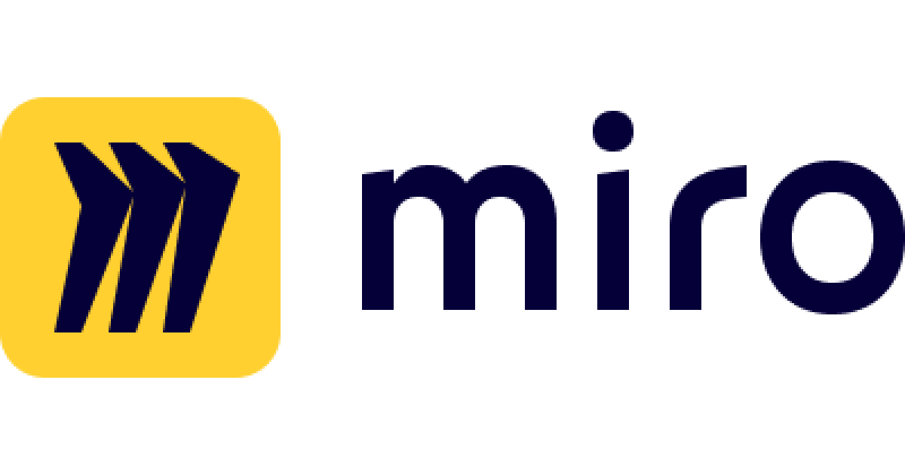

Continuons avec Miro :

Grâce à Miro, nous avons pu réaliser tout un tas d'ateliers qui nous ont porté durant notre projet. Comme nous le verrons plus tard, Miro nous a aidé à répartir des tâches et à faire nos rétrospectives.

  

Voici le lien de notre Miro si vous souhaitez le consulter (vous devrez être connecté à votre compte Google): <a href="https://miro.com/app/board/o9J_lpDE4-g=/" title="Lien Miro">Miro</a>

 

Geany :

Initiallement, Geany était [l'IDE](#lexique) qui nous permettait de compiler du code sur la carte Raspberry Pi (car il était déjà installé, nous avons repris la même carte que le groupe de l'année dernière). Cependant, nous avons complétement basculé sur Qt Creator au début du semestre 4 car nous jugions qu'il était plus complet.

  

Enfin, Qt Creator :

Qt Creator est l'IDE que nous avons le plus utilisé. L'interface graphique a été faite via celle fournie par Qt et le code finale est compilable grâce à Qt. Qt nous a fourni plusieurs bibliothèques intéressantes que nous avons intégré au code.

 

### 3.3 Organisation prévisionnelle 

Dès le départ, nous savions que nous devions mettre en place une organisation efficace afin de gagner du temps. Pour cela, nous nous sommes orientés vers un planning prévisionnel où nous déterminions de façon globale ce que nous voulions faire à chaque semaine. Cette méthode est simple rapide et nous a servie de base tout au long de notre projet.

En voici un extrait :

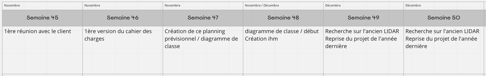

 

Comme nous pouvons le voir, notre planning prévisionnel est constitué de plusieurs colonnes (correspondant aux différentes semaines) 

 

### 3.4 Répartition du travail 

Le planning prévisionnel que nous avons utilisé est pratique, mais très vague. Pour nous répartir du travail chaque semaine, nous avons rapidement dû mettre en place une nouvelle méthode. 

Étant à l'aise avec la méthode Kanban (que nous utilisions parrallèlement dans un autre projet), nous n'avons pas hésiter à l'appliquer pour notre projet.

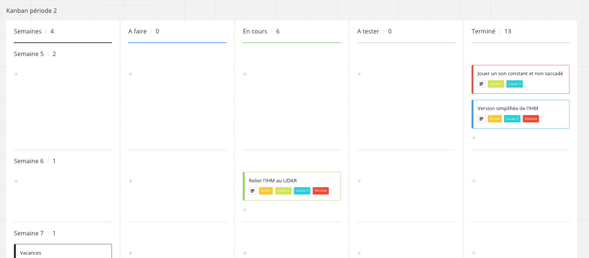

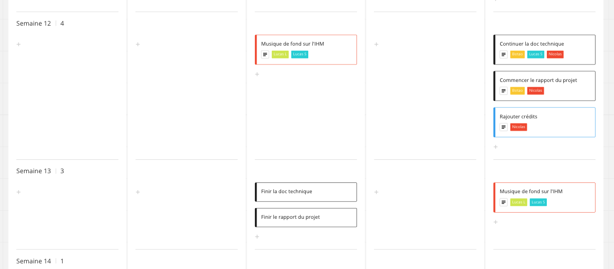

 

Comme nous pouvons le voir, notre Kanban est constitué de plusieurs lignes représentant chacune une semaine de notre projet. Dans ces semaines se trouvent différentes tâches que nous trions par états :
- À faire
- En cours
- À tester
- Terminé

 

Pour changer d'état, une tâche doit suivre des règles que nous nous sommes fixés :
- -> À faire : Une tâche entre dans le kanban si toute l'équipe s'est mise d'accord sur sa definition of ready.
- À faire -> En cours : Une tâche passe à l'état en cours une fois qu'une personne du groupe décide de la commencer.
- En cours -> À tester : La tâche est à tester si la personne travaillant dessus pense avoir validé le definition of done de cette dernière
- À tester -> Terminé : Une tâche est terminée une fois qu'une autre personne de l'équipe l'a vérifiée et considère aussi qu'elle est terminée.

 

Sur ces Users Stories, nous utilisons un code couleur :
- Tâches rouges : Son
- Tâches bleues : [IHM](#lexique)
- Tâches vertes : Mise en commun de travaux / partie shell
- Tâches jaunes : Partie graphique
- Tâches noires : Tâches globales (Soutenance, Vacances, Rapports, ...)

 

Afin de développer un peu plus l'objectif de nos tâches, nous les avons détaillées :

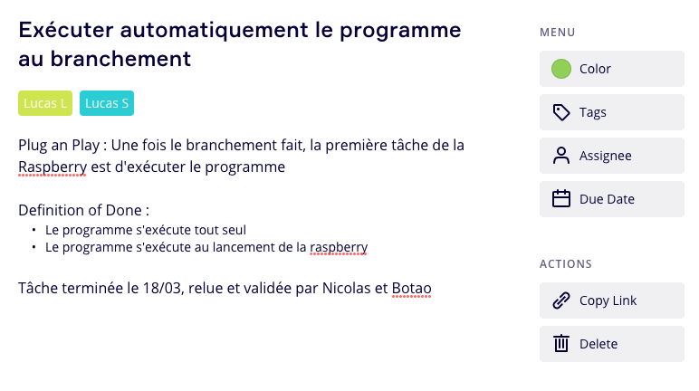

 

Chaque tâche de notre kanban possède une page de détail. On y retrouve une description globale et une description technique (Definition of Done).

Afin d'archiver nos travaux, nous indiquons également le date de validation de nos User Stories et leurs relecteurs.

Nous utilisons des "Tags" afin que tout le monde sâche qui travail sur quoi.

 

### 3.5 Organisation réelle 

Afin de comprendre comment nous nous organisions concrètement lors de notre projetn, nous allons voir un exemple :

Le dimanche de la semaine 11, nous nous sommes rejoint sur Discord vers 20h pour établier un bilan de la semaine. Nous avons validé les tâches de notre semaine :

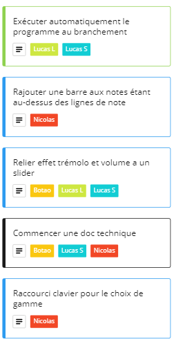  
 

- La tâche "Exécuter automatiquement le programme au branchement" était déjà validée et relue en cours
- La tâche "Rajouter une barre aux notes étant au-dessus des lignes de note a été légérement revue pendant la réunion par Lucas Lalida (qui a décalé la barre de quelques pixels)
- La tâche "Relier effet trémolo et volume à un Slider" a été validée en cours
- La tâche "Commencer une doc technique" a été validé à la réunion
- La tâche "Raccourci clavier pour le choix de gamme" a été validée à la réunion

      

Lors de nos réunion, nous planifions ensuite les différentes User Stories (voir [Répartition du travail](#repartition)) que nous avions à faire pour la semaine suivante (en attribuant leurs attribuant des personnes)

 

Pendant la semaine, nous avons ensuite accomplie tous les objectifs que nous nous sommes fixés sauf 1. Le sujet du bilan d'équipe suivant était donc porté sur cette tâche incomplète.

## 4. Produit 
Concrètement, à quoi ressemble le produit auquel nous avons abouti ? 

### 4.1 Bilan du produit du PTS3 
Tout d'abord, à la fin du premier semestre, notre IHM ressemblait à ceci :

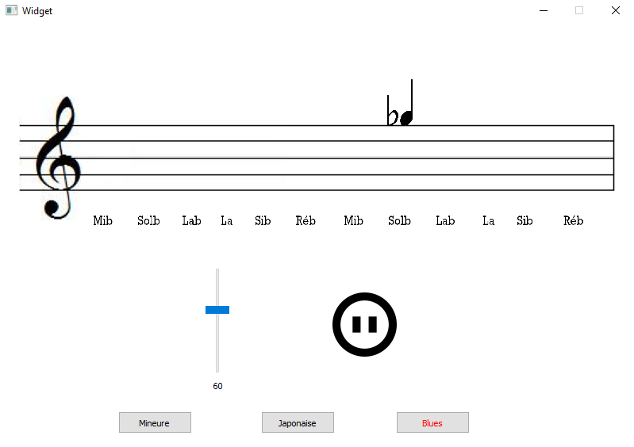

Le slider à gauche était déstiné à une éventuelle réverbération, et le bouton "play/pause" à la musique de fond. Ces deux fonctionnalitées n'était cependant pas encore implémentées. 
Nous avions déjà l'affichage des notes et le choix des gammes mais cette IHM n'était qu'un prototype qui affichait des notes manuellement. Elle n'était pas relié au LIDAR.

 
Au niveau du programme, sur la raspberry, nous avions des crashs très récurrents. Chaque éxécution du code était un lancé de dé.
De plus, les notes jouées par le programme étaient saccadées, comme des bips discontinus, et avaient un léger délai.
Cependant, nous avions une mesure précise de la distance qui nous donnait toujours la note attendue.

 

### 4.2 Objectifs du PTS4 
Voici ce que nous avions prévu sur notre miro pour le deuxième semestre :

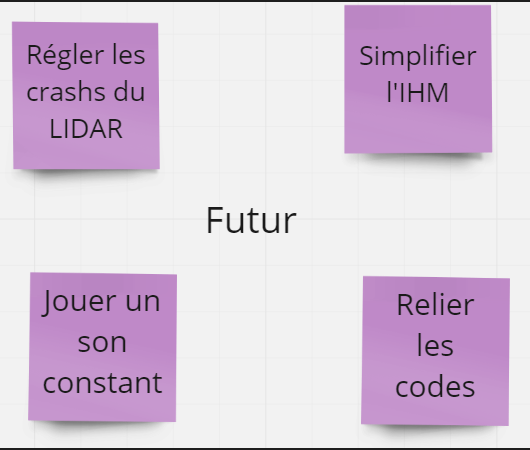

Nous avions simplement prévu de régler les problèmes mentionnés plus tôt (crashs, son discontinus) et de relier la partie graphique à la partie logique.
Nous avions également prévu de simplifier le code de l'IHM qui était assez brouillon.

 

### 4.3 Bilan de réalisation du PTS4 

 

Chaque personne du groupe a eu un rôle particulier et a travaillé sur différentes parties du projet comme ci-dessous :

1. Nicolas : 

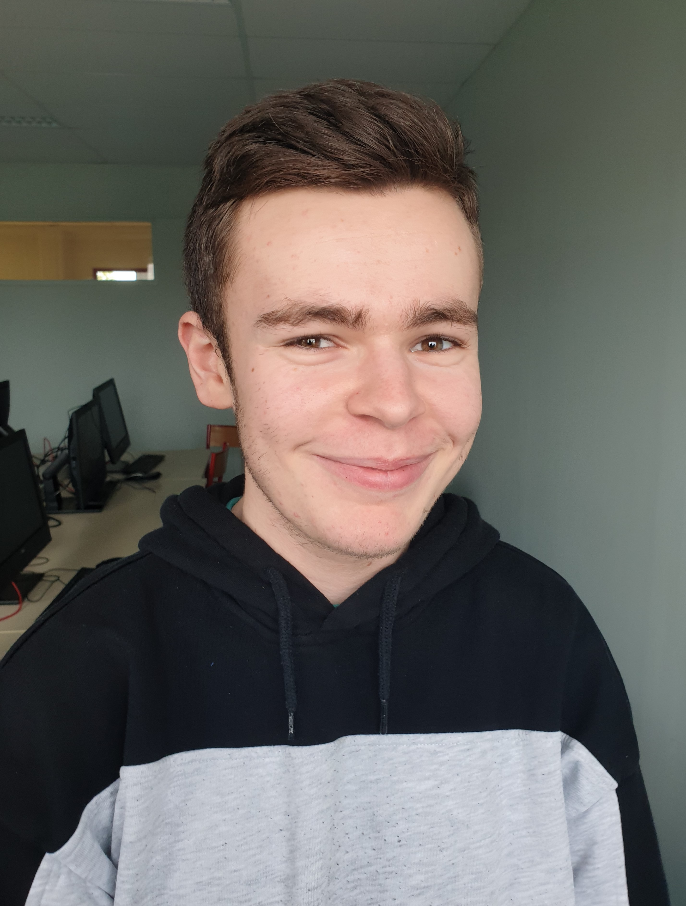

> Lors de ce projet, j'étais en charge de l'organisation et de la répartition des tâches que nous avions à effectuer chaque semaine. J'étais la personne qui organisait nos différents bilans hebdomadaires et qui maintenait le kanban actif. J'ai aussi trouvé les activités de rétrospective du semestre 3 pour l'équipe en vue de partir sur de meilleures base pour la suite du projet. 

> Je me suis aussi beaucoup investi dans les 2 versions de l'interface graphique que nous avons faites. J'ai notamment passé du temps sur la deuxième version où j'ai fait les [sprites](#lexique) des différentes images et où j'ai placé les différentes éléments (dont l'affichage des notes en fonction de la distance envoyée par le LIDAR).

> Enfin, j'ai rédigé la documentation technique avec Lucas Lalida.

 

2. Botao : 

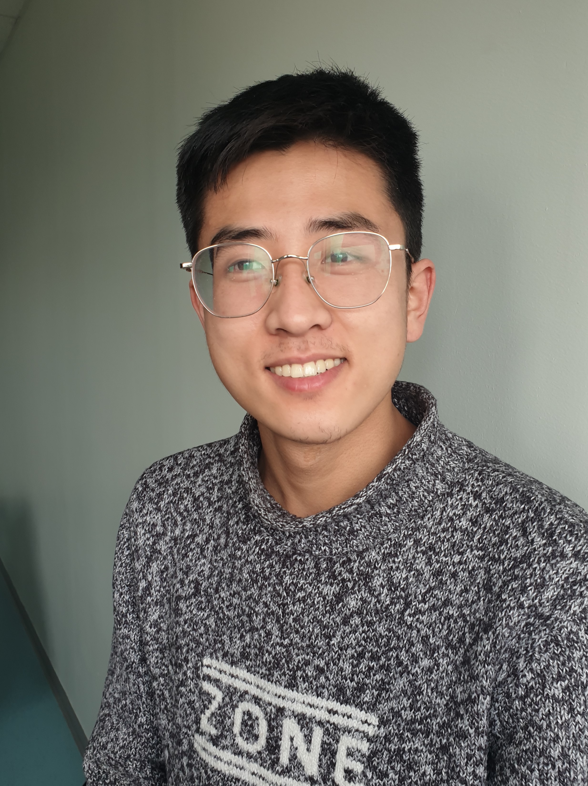

> J'ai travaillé principalement dans la partie IHM. Pendant ce projet, j'ai participé au développement de l'IHM et des raccourcis avec Nicolas, au développement des sliders de volume et trémolo avec Lucas Lalida, ainsi qu'au développement des sliders de distance maximale et minimale avec Lucas Stanislas.

> J'ai aussi créé un prototype d'IHM admin qui pourrait être implémenté dans le futur.

> En plus, j'ai participé aussi à la rédaction du rapport du projet. J'ai rédigé la rétrospective S4 graphique sur Miro.

 

3. Lucas S : 

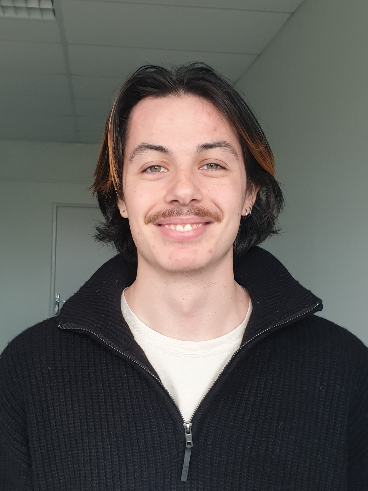

> Pour la réalisation de ce projet, j'ai été polyvalent et j'ai pu porter plusieurs casquettes.

> Tout d'abord, étant à l'aise en communication, on m'a confié la tâche de gérer les discussions avec le client et programmer nos rendez-vous.

> De plus, j'ai fait partie de l'équipe programmation "logique", avec Lucas Lallida. Nous avons fait presque tout le code qui ne concerne pas l'IHM. Nous avons travaillé tout les deux sur la communication avec le LIDAR en port série, sur le lancement du programme au démarrage et sur la musique de fond.
 Entre autres, j'ai imaginé l'architecture du code et j'ai écrit la fonction `bool deuxValeurSurTroisHorsLimite();` qui sert à éliminer en grande partie les potentielles valeurs incohérentes renvoyées par le LIDAR.
  J'ai écrit un prototype de calibrage automatique de la distance maximale qui est dans le code sur GIT. Nous avions discuté avec le client d'une potentielle implémentation de cette fonction dans le futur.

> Enfin, j'ai aidé un peu Nicolas et Botao sur la partie graphique
en conceptualisant l'IHM.

>Et tout au long du projet, j'ai aidé Lucas L sur la gestion de l'équipe.

 

4. Lucas L : 

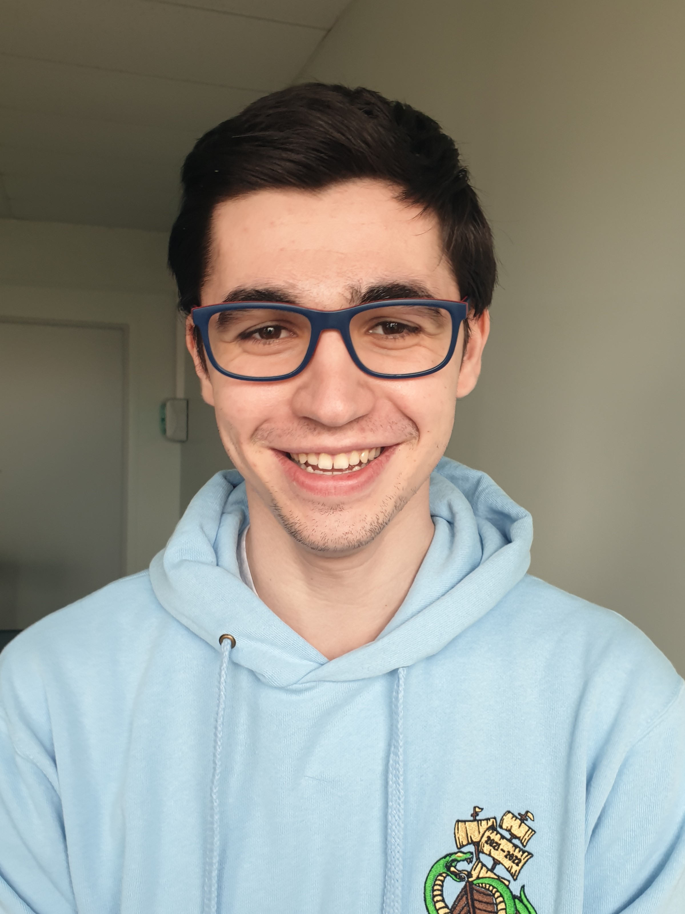

> Lors de ce projet j'étais le chef de projet, j'étais donc le responsable de l'équipe. Dans le projet j'étais chargé du code pour la partie non graphique avec Lucas S. C'est à dire toute la partie configuration du port série pour récuperer les données envoyées par le lidar, la partie pour récuperer les données du lidar, la partie pour jouer un son en fonction de la distance, la partie pour gérer le volume, la partie pour gérer l'effet de trémolo, la partie pour lancer le programme au démarrage et enfin la partie pour lancer une musique de fond. C'est aussi moi qui me suis occupé de rejoindre le code de notre IHM et le code de récupération de la distance.

> Enfin, j'ai rédigé la documentation technique avec Nicolas Godard.

 

Au niveau global, ce que nous avons réussi à produire c'est un programme qui récupère une distance d'un Lidar et qui, en fonction de cette distance joue une note qui est affiché sur une interface. Le code de notre IHM à la fin du PTS3 était assez brouillon donc en la reconcevant, on est parti sur une base épurée et efficace.  

 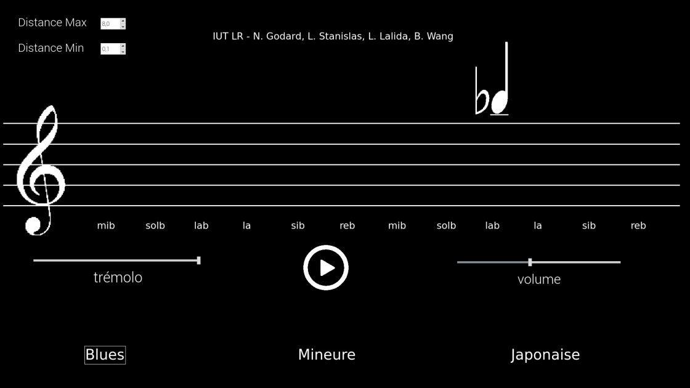 

  

Avec cette interface un utilisateur peut :
1. Voir la note qui est actuellement jouée.
2. Augmenter ou baisser le volume de cette note.
3. Augmenter ou baisser un effet de trémolo sur cette note.
4. Changer de gamme de note.
5. Lancer ou arrêter une musique de fond.
6. Configurer la distance minimale et la distance maximale du Lidar. 

Pour configurer tous cela l'utilisateur peut utiliser une souris et ou un clavier. 

Pour gérer la distance minimale et maximale il suffit d'appuyer sur les flèches qui sont au niveau de la ou sont affichées les distances. Il faut appuyer sur la flèche du haut pour faire augmenter la distance de 10 cm et la flèche du bas pour faire baisser la distance de 10 cm. Pour ce qui est du volume et de l'effet de trémolo ce sont des [sliders](#lexique). 

Pour changer de gamme l'utilisateur peut appuyer sur les flèches droite ou gauche du clavier, il peut appuyer sur les touches "B", "J" et "M" pour choisir une gamme qui correspond à la lettre choisi (exemple "B" pour Blues) ou il peut tout simplement clicker sur la gamme qu'il veut. 

Enfin pour lancer ou arrêter une musique de fond, l'utilisateur peut clicker sur le bouton centrale ou appuyer sur la touche espace. 

Pour quitter le programme il suffit d'appuyer sur la touche Echap. 

Pour ce projet nous avons réalisés une documentation technique que je vous invite à regarder si vous voulez plus de détails technique sur le projet et plus de capture d'écran détaillé sur l'interface. Cette documentation est disponible dans le wiki du Git. 

Tous les objectifs du projet ont été atteints.

Pour ce qui reste à faire il y a l'IHM administrateur que nous avons commencé mais nous n'avons qu'un prototype, il faudrait donc le finir et l'implémenter dans le code. 

Puis nous avons pensés à une fonctionnalités pour calibrer la distance minimale et maximale avec le Lidar. On pourrait choisir de calibrer la distance minimale ou maximale puis après on calibre avec la distance que l'on souhaite en fonction des distances qui sont récuperées par le Lidar. 

Cela pourrais permettre de ne pas avoir besoin de mesurer l'espace disponible dans une pièce pour une démonstration du projet puisque cette fonctionnalité le ferais toute seule.

### 4.4 Aspects techniques 

Le point le plus important de notre projet est la gestion d'un port série. c'étais plutôt compliqué à mettre en place puisque nous n'avions jamais étudié cela auparavant. Grâce à la documentation du lidar nous avons pu configurer la communication avec le lidar sur le port "Serial0". Pour faire cela nous avons utilisé une bibliothèque afin de simplifier cette configuration qui nous posait problème. 

Récupérer des données et les assembler était aussi tout nouveau. Le lidar envoie l'information de la distance en deux fois, nous avons donc du apprendre comment faire pour les remettre ensemble afin d'arriver à une seule donné de distance. 

Nous avons aussi eu des problèmes physique car le lidar quand il vient juste d'être mis en route ne marche que quelques secondes puis envoie des données complétement incohérente. Cela viendrait d'un problème de température interne trop faible. Pour régler ce problème nous avons du fermer et rouvrir le port série à chaque fois que le lidar envoie trop de données incohérente.

Ce problème nous a forcé à vérifier que le port série est bien ouvert à chaque fois que l'on lis sur le port car sinon il y a un risque de lecture sur un port qui n'est pas ouvert, ce qui fais arrêter tout le programme. 

Nous avons aussi pu apprendre comment installer et rendre utilisable des bibliothèques comme expliqué dans la doc technique dans la partie "Bibliothèque".

## 5. Rétrospective finale 

### 5.1 Rétrospectives individuelles   

Nicolas :

* Mon ressenti :
    
> Au cours de ces 5 mois et demi, j'ai toujours considéré le PTS comme l'une de nos meilleures matières. De part les libertés qui nous ont été accordées sur la direction de nos travaux, j'ai appris à surmonter des obstacles qui parfois semblaient infranchissables. 
 
En ce qui concerne le travail d'équipe, je me sentais à l'aise. Je n'ai pas éprouvé de difficulté pour m'imposer et mes échanges avec les autres étaient fluides. De même avec notre client (Monsieur Bestel), chacune de nos discussion ensemble étaient claires (quand j'avais une question, je lui posais).

* Mes difficultés :

> Ayant rejoint le travail de l'IHM en cours de route (lors de la première version), j'ai eu du mal à m'adapter et à comprendre le fonctionnement du code qui m'était proposé. C'est en partie pour cela que nous avons décidé de repartir sur de nouvelles bases en reprenant notre interface graphique à 0.

* Mes accomplissements :

>Je suis fier de l'affichage de la note jouée sur l'interface graphique qui fonctionne sans accroc. De même pour la partie organisation, l'architecture que j'ai mis en place a été respectée par tous les membres de l'équipe et je sens qu'elle a portée ses fruits. 

    

 

Lucas S :

* Mon ressenti :
    
> Travailler sur ce projet à été un vrai plaisir. J'ai pu apprendre beaucoup de choses et voir ce produit prendre forme petit à petit sous mes yeux fut très satisfaisant. Je suis heureux que l'on soit arrivé à un produit qui, non seuleument satisfait le cahier des charges, mais est beau et user-friendly.

* Mes difficultés :

> J'ai parfois eu tendance à vouloir contrôler ce que tout le faisait. J'ai eu du mal à lâcher prise et à faire confiance à l'équipe. J'ai été un peu sur le dos de tout le monde.
Lorsque j'ai enfin commencer à laisser les autres faire, j'ai pu me concentrer beaucoup mieux sur mon propre travail.

* Mes accomplissements :

> Je suis fier de l'architecture du code. J'ai voulu tout au long du projet que nous ayons un code le plus "clean" possible afin qu'il puisse être réutilisé dans le futur.
Je suis aussi très fier du produit final que nous avons produit, en particuler de la réactivité du programme. Il n'y a presque aucun délai et c'était quelque chose de très important pour notre client, Monsieur Bestel.

 

Lucas L :

* Mon ressenti :

> Personnellement ce projet a été très enrichissant, j'ai pu apprendre énormément de chose. 
On est arrivé à une version du projet qui est très satisfaisante. 
On a réussi à s'organiser correctement que ce soit pour la répartition des tâches ou du respect des délais.
J'ai pu travailler sur les choses qui m'interessait vraiment et j'ai pu renforcer mes acquis sur la programmation.
Il y a toujours eu une cohésion de groupe impeccable et le client Monsieur Bestel étais très réactif et sympathique.

* Mes difficultés :

> Ce qui a été le plus dur pour moi été de récuperer les données du lidar. C'étais quelque chose de totalement nouveau et qui m'a posé pas mal de problème au début du projet.
Jouer un son a aussi été très compliqué car la bibliothèque qu'on utilise est pointilleuse et la documentation n'est pas très précise.

* Mes accomplissements :

> Ce dont je suis le plus fier est la version du projet à laquelle on a réussi à arriver. 
Pour être plus précis, ce dont je suis le plus fière au sein du projet est d'avoir réussi à trouver comment lancer le programme au démarrage de la raspberry.
C'étais quelque chose qui nous a demandé beaucoup de temps et la solution à laquelle on est arriver est très satisfaisante et complète.

 

Botao :

* Mon ressenti :
    
>C'est un projet difficile. J'étais inquiet au début lorsque on recevait le lidar avec des fils enchevêtrés et le code complexe du dernier groupe de projet. Mais mon idée a été changé après la première fois qu'ils ont réussi d'afficher les données du Lidar et la première fois que le Raspberry émet le son. Cela m'a donné la confiance. Le processus de développement est dur mais je me sentais à l'aise pendant le travail, grâce à tous les autres du projet.

* Mes difficultés :

>Pour moi, le plus grand problème est la langue. Je peux comprendre ce qu'ils me dirent, mais je peux pas exprimer exactement ce que je pense. Donc ça cause des difficultés sur le transfert du tâche qui conduit à diminution d'efficacité du travail.

* Mes accomplissements :

>Je suis fier de participer au développement de ce projet. Au début, il est juste un logiciel qui émet des sons simples, mais dans nos efforts, il devient une application avec plusieurs fonctionnalités.

 

### 5.2 Rétrospective d'équipe 

Tout au long de notre projet, nous avons mis en place plusieurs rétrospectives globales (en plus des réunions hebdomadaires de répartitions de tâches). 

Nous avons commencé par un atelier "On refait le match" qui a eu lieu fin-Décembre. Le but de cet atelier était de se donner une vision concrète en se posant une question simple "Qu'est-ce qu'on fait maintenant ?".

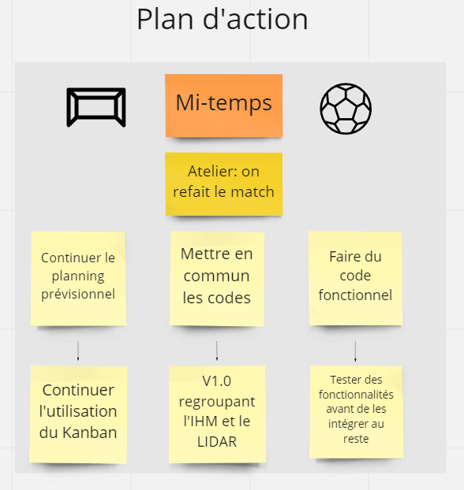

  

Par la suite, nous avons réalisé une seconde rétrospective imagée après notre première soutenance portant sur tout ce que nous avions fait en début février.

- Le bateau symbolise l’équipe
- Le vent symbolise les éléments qui nous ont portés pour répondre à nos engagements : ce qui facilite l’avancée du projet.
- L’île est le symbole des objectifs à atteindre.
- Les rochers les risques du projet

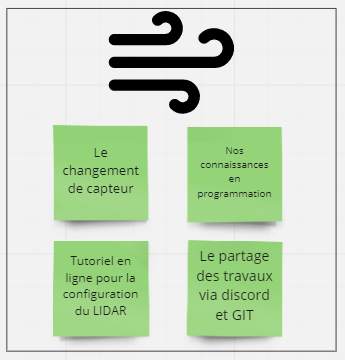&nbsp;&nbsp;&nbsp;
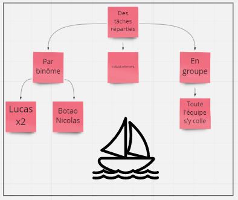

  

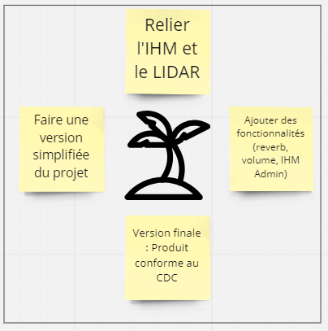&nbsp;&nbsp;
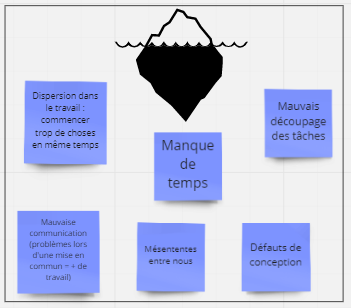

  

Enfin, en fin mars, nous avons réalisé une rétrospective de notre PTS4 sur le thème d'une carte au trésor.

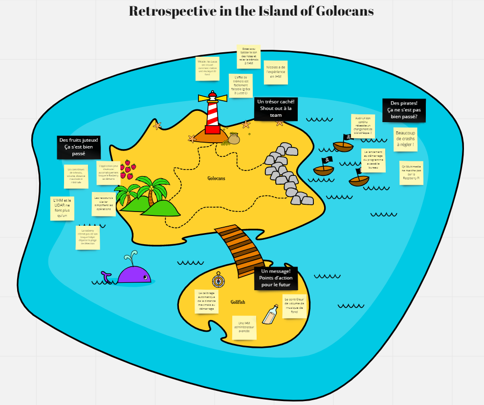

  

- Le fruits représentent ce qui s'est bien passé
- Le trésor symbolise ce qui nous a aidé à progresser
- Les pirates sont les problèmes que l'on a rencontré
- Le message représente nos points d'actions à accomplir dans le futur

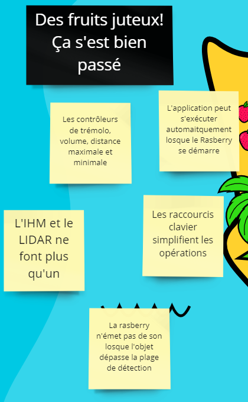&nbsp;&nbsp;&nbsp;&nbsp;&nbsp;&nbsp;
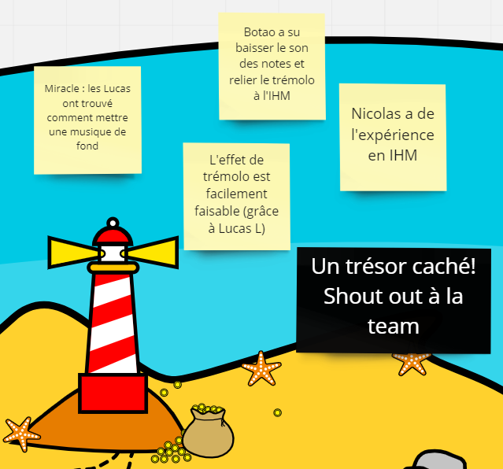

  

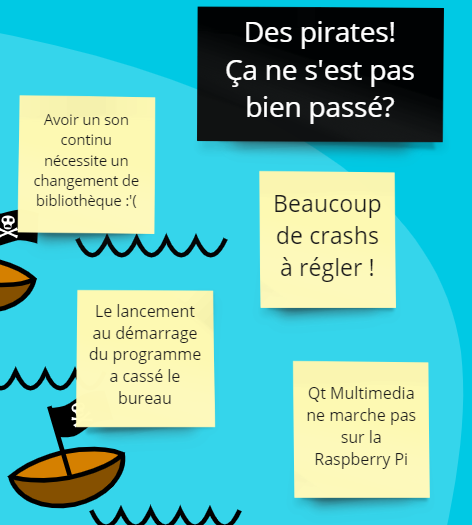&nbsp;&nbsp;
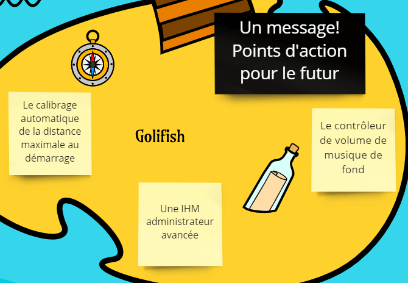

## 6. Bilan du projet 

## 7. Annexes 